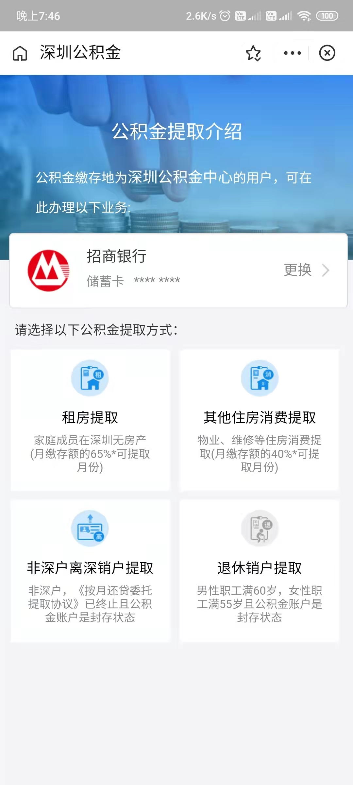

### 深圳 - 公积金
每个城市的公积金提取政策是不一样的，我在广州时，每个月租房可以提取公积金 600 元（可累计）。如果在深圳无房产，可以在深圳租房提取月缴存额度的 65%（可累计）。

提取方式：【支付宝 App 首页】-> 市民中心 -> 公积金 -> 公积金提取（需要人脸识别验证） -> 租房提取（在线提取，直接提现到银行卡）。

当然除了租房提取以外，还有其他提取方式，如下图：

